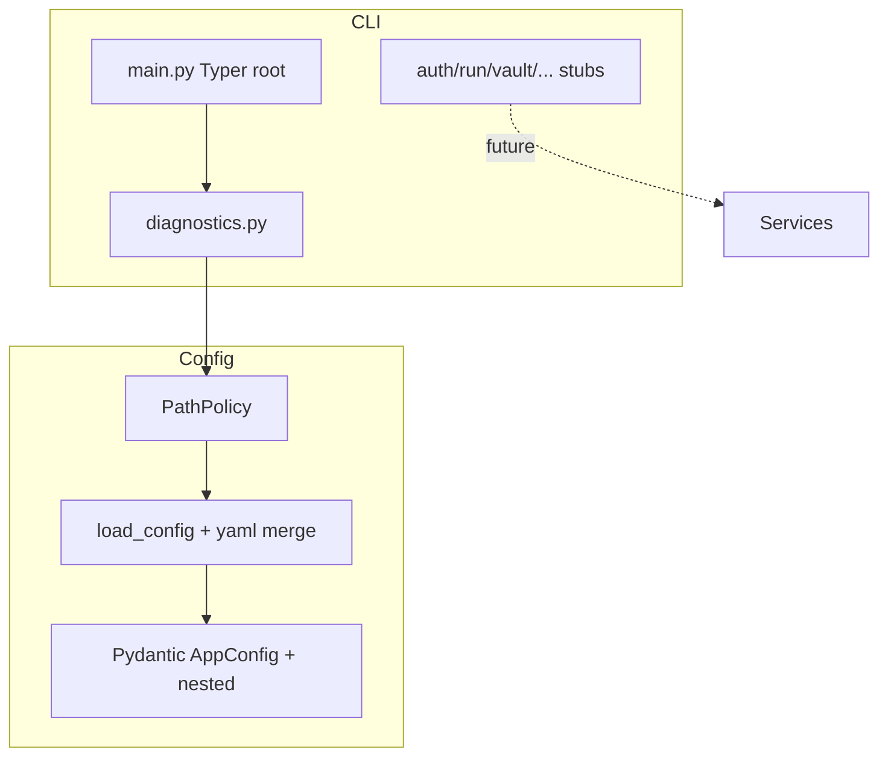

# Phase 1: Repo Scaffold and Local Config Foundation

**Status**: Complete (Prompt 01 executed 2026-05-25)

## Scope
This phase delivered the minimal viable Python package layout, CLI entrypoint, and configuration foundation required by all subsequent phases.

No Microsoft Graph, SQLite, Obsidian writer, or model logic was implemented (reserved for Phases 2+).

## Deliverables

| Artifact | Location |
|----------|----------|
| Package metadata + entrypoint | `pyproject.toml` |
| Typer CLI | `src/hb_assistant/cli/` (diagnostics env --json functional; others stubs) |
| Path resolution + permission hygiene | `src/hb_assistant/config/path_policy.py` |
| Pydantic config models | `src/hb_assistant/config/models.py` |
| YAML loader with override support | `src/hb_assistant/config/loader.py` |
| Tests (config + paths) | `tests/test_config.py` (4+ passing) |
| Architecture + decisions | `docs/architecture/`, `docs/decisions/D-CLI-001.md` |
| Evidence + logs | `docs/evidence/phase-1-*` + updated prompt execution log |

## Component Diagram (Phase 1)

## Key Design Points

- **PathPolicy** is the single source of truth for all local locations (repo, Application Support with 700/600 sensitive dirs, vault, caches, evidence). It creates directories on demand and exposes `check_perms()` for early failure.
- **AppConfig** is pure data; no side effects. Secrets (tenant/client) remain configurable via yaml or future .env/keychain.
- **CLI commands are intentionally thin**. Even the functional `diagnostics env --json` only orchestrates PathPolicy + platform facts. No network or file content reads beyond safe metadata.
- **No write-back paths** exist in the tree (enforced by 20_Manual_Approval_Gates and absence of any mutation code).

## Next Phases (High Level)

- Prompt 02: Auth provider, MSAL delegated + app-only caches, TokenClassifier, token status CLI.
- Prompt 03: Delegated Graph proof (required before any production retrieval).
- Later: full run orchestrator, Obsidian writer, extraction, etc.

## References
- `docs/plans/my-pa-phase-0/02_Final_Implementation_Plan.md` (Phase 1 row)
- `docs/plans/my-pa-phase-0/11_CLI_Agent_And_Automation_Specification.md`
- `docs/plans/my-pa-phase-0/01_Final_Target_Architecture.md` (Local Runtime Layout)
- `docs/evidence/prompt-execution-log.md` (Prompt 01 section)
- `D-CLI-001.md` (Typer decision)
