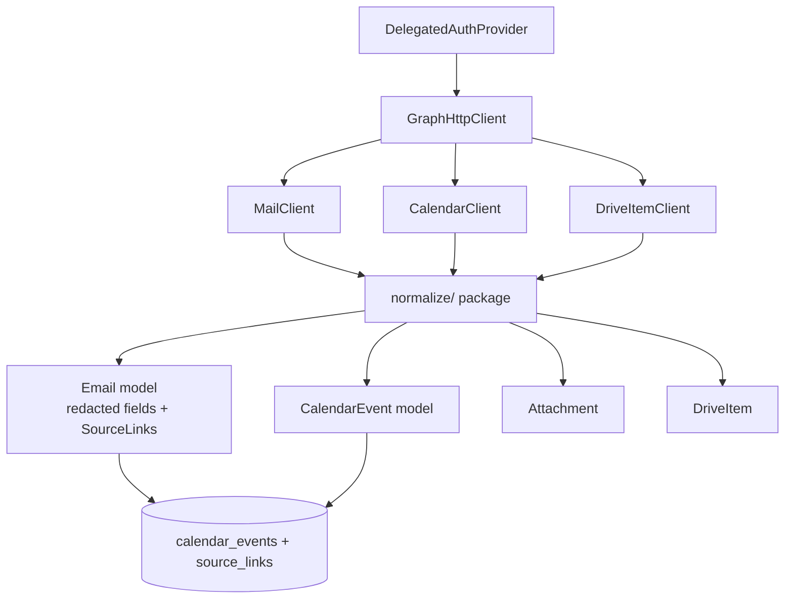

# Phase 4: Graph Mail / Calendar Read Models

**Status**: Complete (Prompt 04)  
**Version**: 0.4.0

## Scope
Implemented the canonical Graph read models for:
- Mail (inbound 5-day lookback, sent 7-day lookback, bounded body retrieval)
- Calendar (calendarView over yesterday/today/next 2 business days)
- Attachments & DriveItem (metadata-first, controlled download hooks)

All objects are redacted, source-linked, and ready for persistence (Phase 5) and downstream extraction/classification.

Built strictly on top of Phase 2 GraphHttpClient + post-Phase 3 delegated proof gate (with the documented assumption that any missing delegated scopes such as Mail.Read are granted during development prior to deployment).

## Architecture

## Key Components

- `src/hb_assistant/normalize/` — Pydantic models (Email, CalendarEvent, Attachment, DriveItem) with consistent redaction (subject hash, sender/recipient domain+hash, truncated bodyPreview, location redaction) and source_link construction using types from resources/source-link-types.json.
- `src/hb_assistant/graph/mail_client.py` — list_inbound / list_sent using exact 06 $select + filter windows; staged body access.
- `src/hb_assistant/graph/calendar_client.py` — list_events over the spec window using calendarView.
- `src/hb_assistant/graph/drive_item_client.py` — metadata + attachment listing (download controlled by later eligibility gates).

## Redaction & Safety Policy (enforced)

- No full email bodies or calendar bodies are ever logged, evidenced, or persisted by these models (body retrieval is explicitly staged/bounded for extraction only).
- Subject, sender/recipients, location, organizer, attendees: hashed or domain-only.
- bodyPreview: truncated.
- All client output is safe for --json diagnostics and evidence.
- Zero M365 mutation paths.

## Scope Requirements

Full success requires the delegated scopes from Phase 3 proof (User.Read, Mail.Read, Calendars.Read, Files.Read.All, offline_access). 403 paths are handled gracefully with clear notes referencing the "granted during dev" assumption.

## Integration Points

- Consumed by Phase 5 (SQLite source_records + emails/calendar_events/attachments/files tables + source_links).
- Fed to Phase 5/6 classification and extraction (mention detection, action extraction).
- Diagnostics helpers (`hb-assistant diagnostics mail sample --json` and `calendar sample --json`) provide safe, redacted verification output.

## References

- 06_Graph_Integration_Specification.md (exact queries, windows, redaction guidance, throttling, forbidden calls)
- 02_Final_Implementation_Plan.md (Phase 4 row + key components)
- 07_Local_Data_Model_And_Source_Link_Registry.md (target tables)
- 05_Delegated_Graph_Proof_Specification.md (proof gate already satisfied)
- Phase 2 GraphHttpClient + auth foundation

This phase completes the read-model layer. The system can now produce normalized, traceable objects for the local state store and all downstream intelligence.
