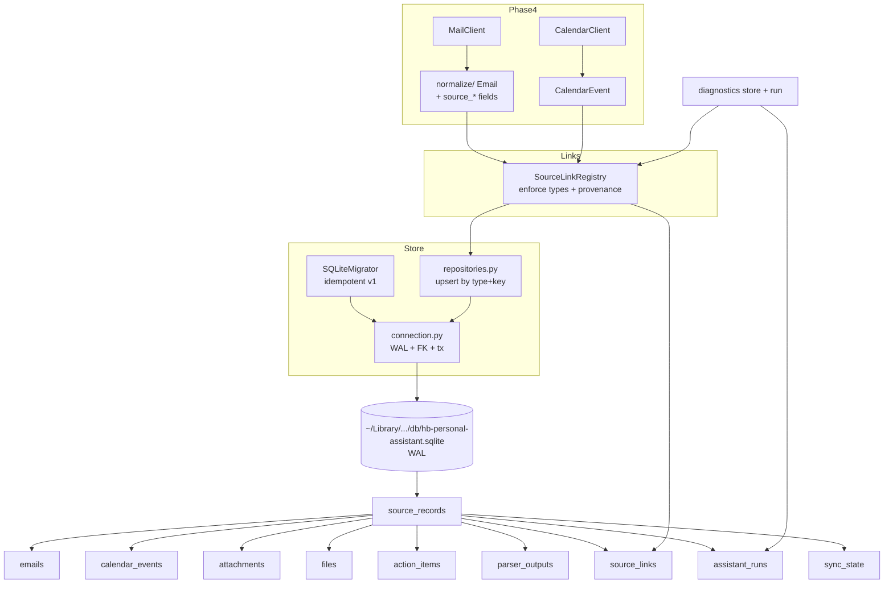

# Phase 5: Local State Store + Source Link Registry

**Status**: Complete (Prompt 05)  
**Version**: 0.5.0

## Scope
Implemented the canonical local SQLite persistence layer (under Application Support via PathPolicy) and the SourceLinkRegistry provenance gate.

This makes Phase 4's redacted, source-linked normalize models (Email, CalendarEvent, Attachment, DriveItem) durable in the 10 core tables defined in 07 + resources/sqlite-schema.sql, plus the assistant_runs run ledger and sync_state.

All per 07_Local_Data_Model_And_Source_Link_Registry.md and 02 plan row 4.

Strict guardrails: read-only M365, zero full bodies/tokens/PEMs ever written to DB or evidence, idempotent non-destructive migrations, provenance enforcement (no persist without valid links), dry-run friendly.

## Architecture

## Key Components

- `src/hb_assistant/store/connection.py`: PRAGMA enforcement (foreign_keys, WAL, busy_timeout), transaction context manager.
- `src/hb_assistant/store/migrator.py`: SQLiteMigrator with embedded v1 schema (CREATE IF NOT EXISTS from resources/sqlite-schema.sql). apply() is fully idempotent.
- `src/hb_assistant/store/repositories.py`: Store facade + upsert by (source_type, source_key), typed persist_* for each normalize model, assistant_runs ledger, low-level link creation, safe get_summary().
- `src/hb_assistant/links/registry.py`: SourceLinkRegistry — the trust/provenance layer. persist_* methods always create at least one valid link (self or attaches for attachments). Rejects unknown link_types. Populates model.source_links post-persist.
- ALLOWED_LINK_TYPES sourced from resources/source-link-types.json (13 types including mentions, attaches, prepares_for, etc.).

## Redaction & Safety (enforced at write time)

- All title_redacted, text_excerpt, sender_domain, hashes only — never raw subject, body, or file content.
- The normalize models (Phase 4) already carry only redacted data; store writes exactly those fields.
- No full bodies or file contents can ever reach the DB through these paths.
- Diagnostics `store --json` and run outputs are explicitly sanitized.

## Integration Points

- PathPolicy.get_db_path() + ensure_dirs() (db/ created 755) — no changes needed.
- Phase 4 clients + normalize models now have live source_record_id + source_links after registry.persist_*.
- CLI: `hb-assistant diagnostics store --json` (safe counts + last run), `run morning --dry-run --json` now records + finishes an assistant_runs entry (exercises ledger immediately).
- Future: Phase 6 classification sets body_checked / body_mention_detected + creates mention links; Phase 7 extraction creates action_items + source_links; Phase 8 obsidian writer creates written_to_note links.

## Migration & Idempotency

- First use of Store or Registry auto-applies v1.
- schema_migrations table tracks applied versions.
- All CREATEs use IF NOT EXISTS; upserts use ON CONFLICT DO UPDATE / NOTHING.
- Safe to run multiple times; no data loss.

## Guardrails & 20 Gates

- No M365 mutation paths (this phase is pure local write of already-fetched redacted data).
- No destructive operations exposed (no reset/wipe commands).
- Dry-run respected in run ledger.
- All evidence and DB rows contain only allowed redacted fields.
- Sensitive scan must remain clean.
- Data lives outside the repo (Application Support) per .gitignore + 13 standards.

## References

- 07_Local_Data_Model_And_Source_Link_Registry.md (tables, upsert rules, provenance gate, SQLite PRAGMAs)
- 02_Final_Implementation_Plan.md (row 4 + component names + expected layout)
- resources/sqlite-schema.sql + source-link-types.json
- 20_Manual_Approval_Gates.md (destructive local state, full bodies)
- 13_Standards, 14_Testing (idempotency tests), 15_Acceptance
- Phase 4 architecture (04-graph-mail-calendar-read-models.md) — the models this phase persists
- Prompt 05 objective + validation commands

This phase completes the durable, traceable foundation. Subsequent phases (classification, extraction, obsidian) now have a real source link registry and run ledger to build upon.
