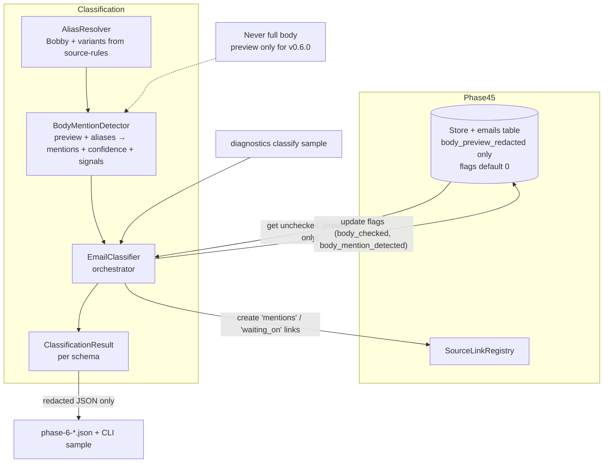

# Phase 6: Body Mention Detection and Email Classification

**Status**: Complete (Prompt 06)  
**Version**: 0.6.0

## Scope
Implemented deterministic, preview-only body mention detection and lightweight email classification on top of the Phase 5 persisted redacted data (emails.body_preview_redacted + the two body_* flags + source_links).

Detects Bobby (and aliases) mentions in the already-redacted, truncated preview text that was safely stored by Phase 4/5 Graph clients. Sets `body_checked` / `body_mention_detected` flags, creates "mentions" and "waiting_on" provenance links via the existing SourceLinkRegistry, and emits `ClassificationResult` objects matching the canonical schema.

All per the Phase 5 row in 02 plan ("Implement aliases, body mentions, direct asks, waiting-on-other candidates"), resources/email-classification.schema.json, source-rules aliases, 07 data model, and strict body safety rules from 03/06/13/20 (never log or persist full bodies).

**Key human decision (documented):** For v0.6.0 we use **only the already-persisted body_preview_redacted**. This guarantees zero full-body handling, satisfies "never log full body" (13/03/06), requires no additional Graph calls or persist_full_body changes, and keeps the entire pipeline redacted by construction. On-demand full staged body retrieval (with strict in-memory + no-persist discipline) remains available for future higher-recall work when explicitly enabled.

## Architecture

## Components

- `src/hb_assistant/classification/aliases.py` — AliasResolver with Bobby Fetting variants (from source-rules.example.yml).
- `src/hb_assistant/classification/detector.py` — BodyMentionDetector (deterministic substring on redacted preview + conservative signals for "possible_direct_ask_or_waiting").
- `src/hb_assistant/classification/classifier.py` — EmailClassifier orchestrator. Updates DB flags, creates links, returns ClassificationResult, mutates in-memory Email model.
- `ClassificationResult` Pydantic model exactly matching resources/email-classification.schema.json.

## Store Extensions (minimal)

- `get_emails_needing_body_check(limit)` — metadata + redacted preview only (no body text columns ever selected).
- `update_email_body_flags(...)` — idempotent flag writes.

## Redaction & Safety (enforced)

- **Input contract**: only `body_preview_redacted` (already truncated + redacted by Phase 4 truncate_preview + redaction helpers).
- Detector and classifier never accept, store, or log any full body text.
- All CLI sample output, ClassificationResult, and evidence contain only redacted flags + classifications strings (e.g. "bobby_mention", "possible_action_or_waiting").
- Links created are provenance only ("mentions", "waiting_on", "derived_from").
- Sensitive scan + explicit leak tests in test_classification.py (search for common secret patterns) must stay clean.

## Integration Points

- Consumes Phase 5 persisted emails (body_preview_redacted + source_record_id).
- Updates the same emails table flags that later phases (extraction, retrieval) will read.
- Creates source_links that Phase 7+ action extraction and Obsidian writer will follow.
- Thin safe CLI: `hb-assistant diagnostics classify sample --json` (synthetic redacted previews → results; no store mutation in sample mode).
- Future orchestrator (Phase 8+) can call `EmailClassifier` on batches from `get_emails_needing_body_check`.

## Human Decisions & Trade-offs (Phase 6)

1. **Preview-only detection (chosen)**: Safe, already-persisted, zero new Graph risk or full-body surface. Matches the "never log full body" rule literally. Higher recall via staged full-body fetch is possible later under explicit config + strict in-memory discipline.
2. **Deterministic rules only**: Alias list + simple contains/heuristics. No local model in v0.6.0 (10 model routing is primarily for extraction in Prompt 07+). Easy to extend with Ollama triage later for ambiguous cases.
3. **Lightweight action/waiting signals**: Conservative phrases create "possible_action_or_waiting" classification + "waiting_on" link. Not full action extraction (that is Prompt 07).
4. **No auto-apply in normal CLI**: Sample helper is read-only for verification. Real runs go through future morning orchestrator (dry-run friendly).

## References

- 02_Final_Implementation_Plan.md (Phase 5 row)
- 07_Local_Data_Model_And_Source_Link_Registry.md + sqlite-schema.sql (flags, links, action_items)
- resources/email-classification.schema.json + source-rules.example.yml (aliases + output contract)
- 03_Delegated_Graph_Proof_Specification.md + 06_Graph_Integration_Specification.md (body retrieval rules, "never log full")
- 13_Standards_And_Best_Practices.md (central redaction, no full bodies in logs/evidence)
- 14_Testing_Validation... + 15_Acceptance... + 20_Manual_Approval_Gates.md
- Phase 4/5 architecture (normalize + store + links foundation)
- Prompt 06 objective

This phase makes the durable source-linked emails from Phase 5 "aware" of mentions and simple action signals without ever crossing the full-body safety boundary. Ready for Prompt 07 (Action Extraction And Schema Validation).
