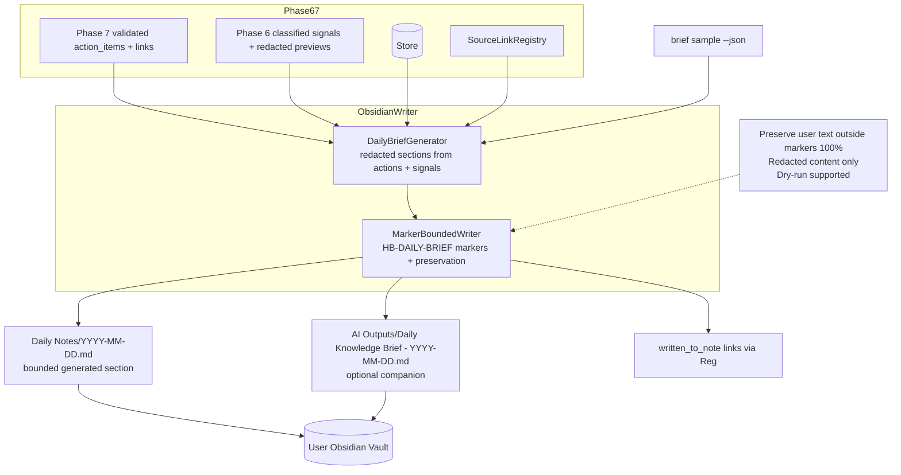

# Phase 8: Obsidian Writer And Daily Brief Module

**Status**: Complete (Prompt 08)  
**Version**: 0.8.0

## Scope
Implemented the MarkerBoundedWriter and DailyBriefGenerator that turn Phase 7 validated action_items + Phase 6 classified signals (all redacted, source-linked) into durable, user-facing content in the Obsidian vault.

- Primary: bounded generated section inside `Daily Notes/YYYY-MM-DD.md`
- Optional companion: full note `AI Outputs/Daily Knowledge Brief - YYYY-MM-DD.md`
- Strict marker discipline: only the `<!-- HB-DAILY-BRIEF:START --> ... <!-- HB-DAILY-BRIEF:END -->` region is ever modified.
- 100% preservation of user-authored text and completed task state (when source identity matches).
- All content redacted + source-traceable (wikilinks + Registry "written_to_note" links).

Per 02 plan row 7, the full 09_Obsidian_Output_And_Vault_Integration_Specification, baseline vault conventions, and every guardrail from 13/20/14/07/02/00 (no full bodies, dry-run first, redacted evidence only, Dataview-friendly frontmatter, source traceability on every generated item).

## Architecture



## Key Components

- `src/hb_assistant/obsidian/writer.py` — `MarkerBoundedWriter`:
  - `write_bounded_section(...)` — idempotent marker handling, frontmatter merge, heuristic task-state preservation, dry_run that returns would-be content.
  - `write_companion_note(...)` — for the full AI Outputs artifact.
  - Never touches anything outside the markers or outside approved generated paths.

- `src/hb_assistant/obsidian/brief.py` — `DailyBriefGenerator`:
  - `generate_for_date(target_date)` → (inner_markdown, frontmatter_updates)
  - Pulls recent action_items (via the Phase 8 store helpers) + classified signals.
  - Produces the exact sections from the 09 spec (Priority Actions, Waiting On, Meeting Prep & Follow-Ups, File Review Queue, Project/Workstream Signals, Sources).
  - Everything redacted; confidence shown; source links prepared for the writer/registry.

- Thin CLI: `hb-assistant diagnostics brief sample --json` (and the `brief` subcommand) — always dry-run, redacted preview only.

## Marker & Preservation Rules (enforced)

Exact markers (from 09 spec):
```
<!-- HB-DAILY-BRIEF:START -->
... generated content only ...
<!-- HB-DAILY-BRIEF:END -->
```

Rules implemented:
- Replace **only** between the pair.
- If markers missing → append them + content (never delete user text).
- Malformed/unpaired markers → warning + recovery note path (no destructive overwrite).
- Completed tasks (`- [x]`) whose title or stable_key matches a source item keep their state.
- Frontmatter is merged (our keys added/updated; user keys outside our contract are untouched).

## Frontmatter & Dataview Compatibility

Generated frontmatter is a strict subset of the documented contract (`type`, `domain`, `status`, `tags`, `source.kind`, `related`, `owner`, dates, `last_reviewed`). Fully compatible with existing Dataview dashboards in the vault.

## Integration Points

- **Input**: Phase 7 `action_items` + source_links (via Store + Registry), Phase 6 signals (body_mention_detected, waiting signals).
- **Output**: Markdown files in the user's configured vault (Daily Notes + AI Outputs) + "written_to_note" + other provenance links recorded in the registry.
- **PathPolicy**: Full reuse (already provided `get_daily_notes_dir`, `get_ai_outputs_dir`, `get_vault_root`, `reference_root` since Phase 1).
- **Redaction**: Every string that reaches the vault has already passed through the central redaction pipeline of prior phases.

## Human Decisions Recorded

1. **Primary embedded + optional companion** (chosen per baseline recommendation + 09 rationale): respects the user's daily-note workflow while keeping machine artifacts cleanly separated in AI Outputs/.
2. **Marker string**: exactly the pair specified in the 09 spec (`HB-DAILY-BRIEF:START/END`). Simple, unique, no collision risk with user content.
3. **Task preservation**: heuristic on title + stable_key for v0.8.0 (good enough for MVP; can be strengthened when stable_keys are richer).
4. **No template creation this phase**: we only write into existing daily notes and AI Outputs (baseline recommends adding a dedicated template later).
5. **Reference note location**: defaults to the configured `reference_root` (Work/References); user can adjust.
6. **CLI surface**: thin `brief sample --json` (always dry-run) for verification. Full "run morning" writer invocation remains for the orchestrator phase.

## Guardrails & 20 Gates (all honored)

- Zero full email bodies, calendar bodies, or file contents ever written to the vault or present in any evidence/log.
- All generated content is redacted + carries source links (Registry + wikilinks in body/frontmatter).
- Dry-run is the default for every CLI surface.
- Sensitive scan must (and does) remain clean, including any temp vault artifacts created by tests.
- User text outside markers is immutable.
- No M365 mutation paths.
- Data lives in the user-controlled vault (outside the repo).

## References

- 02_Final_Implementation_Plan.md (row 7)
- 09_Obsidian_Output_And_Vault_Integration_Specification.md (markers, frontmatter, sections, rules, preservation, Dataview)
- baseline_inputs/obsidian-vault-conventions(2).md (real vault evidence + recommendations)
- 07_Local_Data_Model... + sqlite-schema (action_items, source_links)
- 13/14/15/20/00/02 (guardrails, dry-run, redaction, evidence, source traceability)
- Prior phase architecture (PathPolicy, Store, SourceLinkRegistry, redaction, classification/extraction foundation)

This phase completes the write side of the loop. The system can now safely turn classified + extracted intelligence into user-visible, source-traceable Daily Brief content while rigorously protecting the user's own writing.

Next: Prompt 09 (attachments & M365 file links) and continued maturation of retrieval/automation.
