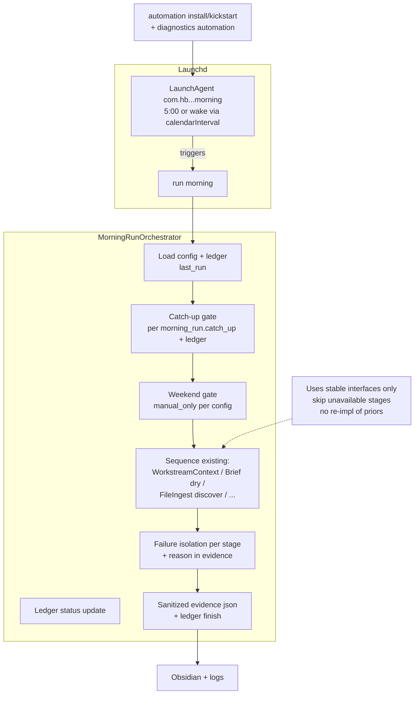

# 12 — Launchd Automation And Diagnostics

**Version**: 1.2.0 (Prompt 12)
**Status**: Complete
**Date**: 2026-05-25

## Overview

Prompt 12 delivers the local scheduling and morning orchestration capability for the HB Personal Assistant MVP:

- User LaunchAgent (launchd) for 05:00 America/New_York (or configured) morning run, with explicit logs and working directory.
- Bounded production-shaped `MorningRunOrchestrator` that applies catch-up-after-wake, weekend manual-only gate (20), ledger tracking, sequences existing stable services (retrieval context, brief, file discovery, etc.), isolates stage failures with reasons, and emits sanitized evidence.
- `LaunchdManager` (plistlib + launchctl) for install / uninstall / kickstart / status.
- Thin safe CLI under `automation` (install-launchd --dry-run etc.).
- Diagnostics: new `diagnostics automation` (exact readiness for plist, ledger, gates, paths, perms, Obsidian) + secondary MVP bounded `scan-sensitive` (categories only on repo + app-support paths; no secret values).
- All read-only M365, dry-run first, macOS launchd native, no shell profile dep, strong redaction.
- Prompt 03 remediation: launchd executable and working directory now resolve from explicit config overrides (or safe runtime defaults), and dry-run reports blocking readiness if executable/path validation fails.

Follows 02 row 10 (launchd automation), 11_CLI spec, 18 runbook, 20 gates (weekend), 14/15/12_Risk/16/17 plans, and D-P12-001/002/003.

## Key Components

- `src/hb_assistant/automation/launchd_manager.py`: LaunchdManager (render via plistlib dict from config + PathPolicy, ensure dirs, subprocess launchctl with sanitized output, status, dry-run preview).
- `src/hb_assistant/automation/orchestrator.py`: MorningRunOrchestrator (gates + ledger, stage loop with try/except skip+reason, calls to WorkstreamContextBuilder / DailyBriefGenerator / FileIngestionService etc. via stable imports, evidence json under evidence/phase-12-runs).
- `src/hb_assistant/cli/automation.py`: Typer commands (install/uninstall/kickstart).
- Edits to `cli/main.py` (wiring + minimal delegation in run morning).
- `cli/diagnostics.py` (automation status + real scan-sensitive MVP).
- Minor PathPolicy (run-logs / error-logs subdirs).

## Mermaid: Phase 12 Launchd + Orchestrator Flow

## Decisions (D-P12-*)

- D-P12-001: Bounded production-shaped orchestrator (sequences existing, gates, isolation, evidence). No thin demo, no broad refactor or re-implementation.
- D-P12-002: Diagnostics primary = automation readiness (exact list). scan-sensitive secondary/MVP bounded (repo+support, categories only).
- D-P12-003: Version 1.2.0, feat(automation) commit.

Launchd is User LaunchAgent only; calendar-driven; explicit logs; catch-up via ledger (best-effort wake heuristic); weekend gate enforced in orchestrator.

## Integration & Guardrails

- Uses existing: Store/ledger/registry, PathPolicy, load_config().automation.morning_run, retrieval context, obsidian brief (dry), files service (discover dry), etc.
- Evidence always sanitized (redact ~ home, no tokens/bodies).
- 20 weekend gate + 12_Risk sleep-miss mitigation via ledger.
- Dry-run everywhere; darwin launchctl calls isolated.
- No M365 writes; read-only.

Refs: 02 (row 10 + expected layout), 11_CLI (automation commands + launchd section), 18 runbook, 20 gates, 14/15/12_Risk/16/17, config models, research (Apple launchd docs).

## Next

Prompt 13 (Testing, Hardening, Final Closeout) — uses the automation + orchestrator + diagnostics + full evidence/sensitive scans for closure checklist and mutation lockout verification.

Ready for scheduled, reliable, auditable morning runs on macOS.
