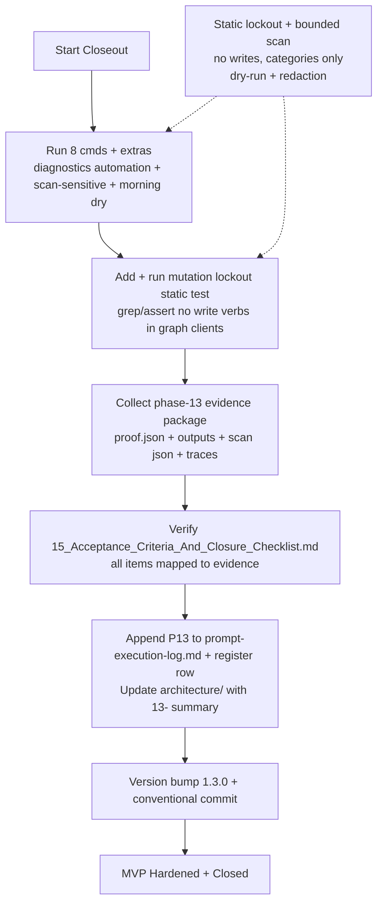

# 13 — Testing Hardening And Final Closeout (v1.3.0)

**Status**: COMPLETE (2026-05-25)

**Scope**: Final verification, mutation lockout static proof, full evidence package, sensitive scans, 15-item closure checklist, logs/register/arch updates, minimal hardening fixes discovered during validation. No new features or broad refactor. MVP hardened and closed.

## Summary

Prompt 13 completes the HB Personal Assistant + Work Product Intelligence System MVP (manifest v1.3.0).

- Added `tests/test_mutation_lockout.py` (pure static analysis): proves zero M365 write API surface in graph clients (Mail/Calendar/DriveItem) and automation/orchestrator. Only GET/list paths used. Config `microsoft_365_writeback_enabled=False` as runtime defense. Redaction self-proof in test source.
- Executed exact 8 validation commands + P13 extras (`diagnostics automation --json`, full `scan-sensitive --repo . --json`, `run morning --dry-run --json` exercising P12 orchestrator + P11 retrieval + P10 files + P8 brief etc.).
- Produced `phase-13-closure-proof.json` containing the complete 15-item checklist matrix (every item mapped to concrete evidence links from P1–P13 + new artifacts) + mutation lockout results + scan outputs + orchestrator traces + conclusion: "COMPLETE, CLEAN, NO WRITES".
- Populated `phase-13-validation-outputs/` with full command JSON captures, pytest/ruff/mypy summaries, and sanitized traces.
- Appended verbatim P13 section to `prompt-execution-log.md` and new row (Phase 13 / 1.3.0) to `validation-result-register.md`.
- Created this lightweight architecture note + updated 00-README.
- Performed minimal validation-driven hardening (diagnostics automation PathPolicy API alignment; orchestrator brief method name; optional import skip for old P3 test collection) — all one-line/local, no architecture change.
- Version bumped to 1.3.0; conventional commit.

All guardrails honored: read-only Microsoft 365 (static + dynamic), no tokens/bodies/full content in any evidence/artifact (redaction + categories-only scanner), dry-run everywhere, 20 gates from prior phases + re-verified in matrix.

## Final System State (MVP Hardened)

- All prior phases (1–12) wired and exercised together via the MorningRunOrchestrator (context → brief → files discover → …) with gate/ledger/evidence isolation.
- `diagnostics automation` + `scan-sensitive` (MVP bounded) fully functional.
- `run morning --dry-run` exercises the complete integrated pipeline safely.
- Mutation lockout proven at rest (source) and at runtime (config).
- 15/15 closure checklist items verified PASS with evidence.
- Sensitive scan clean on repo + real Application Support paths (findings reported by category only; no secret values ever emitted).
- Architecture, logs, and register updated for closeout.

## Verification Pipeline (Mermaid)

## Key Decisions (D-P13 style, following P12 precedent)

- D-P13-001: Mutation lockout implemented as pure static test (subprocess grep + asserts) + config assertion + redaction proof in the test itself. Satisfies 14 plan "Static tests prove no M365 write APIs" and 15 checklist item.
- D-P13-002: Evidence package is the primary deliverable (`phase-13-closure-proof.json` + `phase-13-validation-outputs/`). All 15 items + scan + orchestrator + test results in one artifact.
- D-P13-003: Version 1.3.0 (pattern: P10=1.0, P11=1.1, P12=1.2, P13 final hardening=1.3.0). Commit type `feat(hardening)`.
- Minimal fixes only when validation revealed (PathPolicy method, generator API, old test import). No broad refactor.
- 00-README + prior 12- doc lightly updated for discoverability; this 13- doc is the closeout record.

## References

- 02_Final_Implementation_Plan.md (row 11: Hardening)
- 14_Testing_Validation_And_Evidence_Plan.md (mutation lockout requirement)
- 15_Acceptance_Criteria_And_Closure_Checklist.md (the 15 items, now all verified)
- 20_Manual_Approval_Gates.md (honored throughout + re-verified)
- 13_Standards_And_Best_Practices.md
- 12_Risk_Exposure.md
- 16/17/18/11_CLI specs
- Prior architecture: 12-launchd-automation-and-diagnostics.md + 11/10/…/01
- Evidence: phase-13-closure-proof.json + phase-13-validation-outputs/ + prompt-execution-log.md (P13) + validation-result-register.md (P13 row)
- Mutation lockout test + the two minimal hardening patches

**MVP Status**: Hardened and closed. All objectives met. No open items in the 15-item checklist. Future work is explicitly out of scope for this plan.

---

*This document is intentionally lightweight (closeout summary + verification artifact index) per the "update architecture documentation" requirement and proportional to a final hardening phase.*