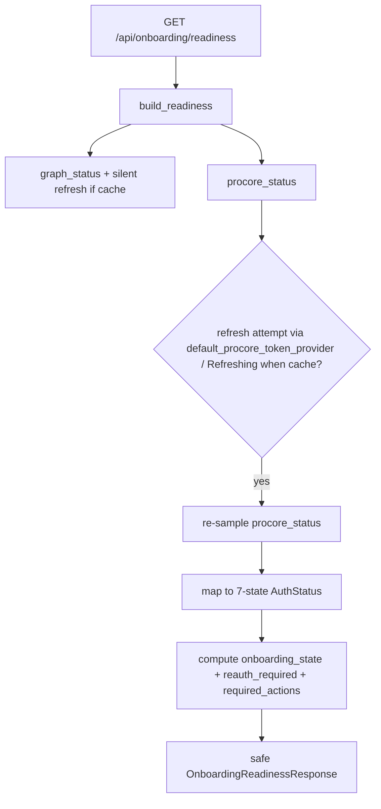

# Prompt C — Procore Local OAuth Flow (Architecture)

**Date:** 2026-06-07  
**Package:** HB_Auth_Onboarding_Implementation_Package (Prompt C)  
**Status:** Implemented (additive)

## Objective

Implement a usable Procore local OAuth flow behind the normalized route contract:

- Backend-controlled authorization start (POST start returns safe authorize URL + opaque flow_id).
- Localhost callback target (GET /callback) with state (CSRF) validation, server-side token exchange, and minimal safe HTML response.
- Safe status polling (GET /status?flow_id) for pending/complete/expired/failed states.
- Manual code fallback (POST /exchange-code) for OOB cases.
- Local disconnect (POST /disconnect-local) clears only local cache.
- Verified status + refresh-before-reauth: when cache present, attempt refresh via the RefreshingOAuthTokenProvider/default chain before classifying `connected_stale_*` or `reauth_required`.
- All frontend-facing responses are safe: no tokens, secrets, codes, state values, local cache paths, raw Procore payloads, or PEMs.

Non-scope: no Procore data sync, no writeback to Procore, no raw payloads exposed, tests do not require real Procore credentials.

## Route Contract (Additive)

Under `/api/settings/connections/procore/auth/*` (new normalized family):

- `POST /api/settings/connections/procore/auth/start` — operator role; returns `{flow_id, authorization_url, expires_at, callback_mode, manual_code_fallback_available, message, guardrails}`.
- `GET /api/settings/connections/procore/auth/callback?code=...&state=...` — browser redirect target (no UI role header required; protected by state+one-time code). Performs exchange server-side and returns minimal static HTML ("Procore connected. You may return to the app." or safe error). Never includes tokens/paths.
- `GET /api/settings/connections/procore/auth/status?flow_id=...` — operator; returns `{flow_id, status: "pending"|"expired"|"failed", message, guardrails}` (terminal states are observed via the accounts/readiness surfaces after callback/manual exchange succeeds).
- `POST /api/settings/connections/procore/auth/exchange-code` — operator; manual OOB fallback; reuses exchange but returns shape without `cache_path` (normalized_path flag).
- `POST /api/settings/connections/procore/disconnect-local` — operator; clears local token cache only; safe response.

Legacy root-level surfaces (`/auth/procore/*`) are untouched and continue to function for any internal/compat use.

See `04_BACKEND_ROUTE_CONTRACTS.md` and `auth_route_contracts.json` in the package for the canonical request/response shapes and the 7 AuthStatus / 5 OnboardingState models.

## Implementation Notes

### Service (`AuthOnboardingService`)

- In-memory `_PROCORE_FLOWS` (flow_id → slot with `state`, `started_at`, `expires_in`, profile metadata). Short-lived (10 min); popped on success/expiry/use; never persisted.
- `start_procore_auth_flow`: load profile via `load_procore_app_profile`, instantiate `ProcoreOAuthClient(environment)`, generate flow_id + CSRF state, build URL (append state if not present), determine `callback_mode` from registered redirect_uri (localhost vs oob), return safe start envelope.
- `handle_procore_oauth_callback(code, state)`: locate slot by state (CSRF), expiry check, exchange via client (server-side only), `write_token_cache(token_set)` (discard returned path), pop slot, return minimal safe HTML. On any error path return safe HTML without leaking details.
- `poll_procore_auth_status(flow_id)`: expiry/pending logic; completed flows are absent (success is observed via `procore_status` / readiness / accounts).
- `exchange_procore_oauth_code(code, normalized_path=True)`: wrapper around legacy exchange that omits `cache_path` when `normalized_path`.
- `disconnect_procore_local`: calls `clear_token_cache()` (best-effort); safe response.

All new surfaces reuse existing `ProcoreOAuthClient` (URL + exchange) and `token_provider` (`write_token_cache`, `clear_token_cache`, `default_procore_token_provider` / `RefreshingOAuthTokenProvider`).

### Verified Status + Refresh-before-reauth

- `procore_status` (existing) reports cache presence, access/refresh cached, expiry, chain order.
- Enhancement: in `build_readiness` and `attempt_auth_refresh`, when cache present for procore, explicitly drive a token acquisition through the default provider chain. This exercises `RefreshingOAuthTokenProvider` refresh logic before the mapper decides `connected_stale_*` vs `connected_valid`.
- `_map_internal_to_auth_status` (procore branch) promotes cache_present + access_cached / ready_for_live_calls → `connected_valid`; cache without access → `connected_stale_reauth_required`; otherwise `never_connected`. The pre-sample refresh allows promotion to valid for returning users.

Readiness and accounts summaries incorporate the refreshed procore status; no auto-sync is triggered.

### Guardrails (Enforced)

- No tokens, secrets, authorization codes, state values, cache paths, raw Procore payloads, or PEM material in any response under the new contract paths (or in HTML callback body).
- Callback HTML is minimal static text only.
- Role model: mutating surfaces (start, exchange, disconnect, status poll) require `operator` (or admin); the browser callback is deliberately not role-gated (CSRF + one-time code is the protection).
- No setup/auth action starts live sync.
- Local-only: disconnect clears local cache; no revocation call to Procore.
- Legacy surfaces preserved; new contract is additive.

Redaction attestations and the `FORBIDDEN` list in tests continue to cover the new surfaces.

## State Machines

### Per-Flow (in-memory, short-lived)

```
start (operator)
  → pending (pollable)
  → (browser callback or manual exchange-code)
      → success (slot popped; procore_status becomes verified on next sample)
      → or error/expired (safe terminal)
```

### AuthStatus for Procore Source (7 states)

Supported via the refreshed status + mapper (same set as Graph):

- `never_connected`
- `connected_valid` (after successful exchange + refresh verification)
- `connected_refreshing` (transient)
- `connected_stale_refreshable`
- `connected_stale_reauth_required`
- `connected_error`
- `disconnected_by_user`

OnboardingState and required_actions incorporate procore reauth when present.

## Diagrams

### OAuth Dance (Start → Callback or Manual)

```mermaid
sequenceDiagram
    participant F as Frontend (operator)
    participant B as Backend (AuthOnboardingService)
    participant P as Procore (browser)
    participant C as ProcoreOAuthClient
    participant T as TokenProvider (write/refresh)

    F->>B: POST /procore/auth/start (X-HB-UI-Role: operator)
    B->>B: generate flow_id + state (CSRF)
    B->>C: build_authorization_url()
    B-->>F: {flow_id, authorization_url (w/ state), callback_mode, ...}
    Note over F,P: User opens URL in browser; authorizes app
    P-->>B: GET /procore/auth/callback?code=...&state=...
    B->>B: validate state vs _PROCORE_FLOWS[flow_id]
    B->>C: exchange_authorization_code(code)
    C-->>B: TokenSet
    B->>T: write_token_cache(TokenSet)  [path discarded; never returned]
    B->>B: pop flow slot
    B-->>P: 200 text/html "Procore connected. You may return to the app."
    Note over F,B: (alt) manual: POST /exchange-code {code} (normalized)
    F->>B: GET /procore/auth/status?flow_id (operator)
    B-->>F: {status: pending|expired|failed, ...} (complete observed via accounts/readiness)
```

### Readiness Verify (Refresh-before-reauth for Procore)



## References

- Planning: `docs/planning/HB_Auth_Onboarding_Implementation_Package/04_BACKEND_ROUTE_CONTRACTS.md`, `auth_route_contracts.json`, `PROMPT_C_PROCORE_LOCAL_OAUTH_FLOW.md`
- Prior architecture: `172-prompt-a-auth-route-contracts-and-safe-models.md`, `173-prompt-b-microsoft-graph-local-auth-flow.md`
- Implementation: `src/hb_assistant/construction/analytics/api.py`, `auth_onboarding.py`
- Tests: `tests/test_fastapi_analytics_auth_onboarding.py` (primary), `..._settings.py`, `..._app_shell.py`
- Reused: `hb_assistant/procore/{config.py, oauth.py, token_provider.py}` (profile, client, write/clear/refresh chain)
- Guardrails: `FORBIDDEN` list + `_assert_no_forbidden` / `_assert_safe` in tests; no auto-sync in readiness or auth paths.

## Changed Files (Minimal)

- `src/hb_assistant/construction/analytics/api.py` (new routes only)
- `src/hb_assistant/construction/analytics/auth_onboarding.py` (flow store + 5 methods + refresh wiring in readiness/refresh)
- `tests/test_fastapi_analytics_auth_onboarding.py` (fake extension + 4 new tests + safety)
- `tests/test_fastapi_analytics_settings.py` (light reachability)
- `tests/test_fastapi_analytics_app_shell.py` (paths set + surfaces list)
- `docs/architecture/174-prompt-c-procore-local-oauth-flow.md` (this doc)

## Validation

Executed (per prompt):

```bash
python -m pytest tests/test_fastapi_analytics_auth_onboarding.py -k 'procore or readiness or secret'
python -m ruff check src/hb_assistant/integrations src/hb_assistant/construction/analytics tests/test_fastapi_analytics_auth_onboarding.py
python -m mypy src/hb_assistant/construction/analytics
```

All green after fixes (see run-validation evidence in session).

## Acceptance

- Backend generates safe authorization URL + opaque flow_id.
- Callback validates state before exchange; token exchange server-side only.
- Manual fallback exists.
- Connected status returns safe account hints; refresh attempted before reauth for returning users.
- Local disconnect clears only local state.
- No token/secret/code/state/cache_path/raw payload in responses or callback HTML.
- Legacy surfaces untouched.
- No live sync started by auth paths.
- Tests prove safety and the 7-state/5-state contract.

## Risks / Notes

- If the registered Procore app does not allow localhost redirect, callback_mode reports "oob" and manual fallback is the path (documented in start response).
- Callback HTML is intentionally minimal and contains no dynamic values.
- Flow state is in-memory only and short-lived (survives only the dance window).
- The implementation re-uses the existing Procore client/token_provider exactly; no new external surface or writeback.