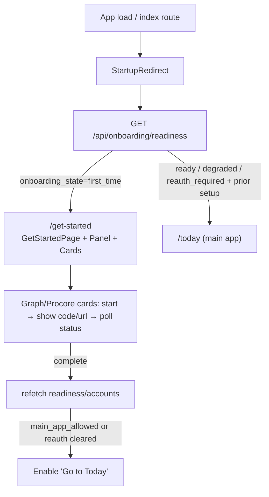
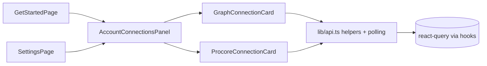

# Prompt D — Get Started and Account Connections UX (Architecture)

**Date:** 2026-06-07  
**Package:** HB_Auth_Onboarding_Implementation_Package (Prompt D)  
**Status:** Implemented (additive, frontend-only surface on top of existing normalized backend contract)

## Objective

Provide first-time onboarding and usable account authentication UX in the frontend:

- `/get-started` route for unauthenticated/first-time sessions.
- Startup readiness guard using `GET /api/onboarding/readiness` that routes `first_time` to Get Started while sending returning/stale-auth users (with `has_prior_setup`) to the main app (Today) with reauth surfaces visible in the connection panel rather than a full reset.
- Microsoft 365 account connection card (device-code start, one-time code + verification URI display/copy/open, safe polling for pending/complete/expired/failed).
- Procore account connection card (OAuth start → open authorization URL, backend callback or manual code fallback, safe polling).
- Typed helpers in `frontend/src/lib/api.ts` for the normalized auth/account routes.
- Remove normal-user raw JSON/debug panels from the Settings account connections section (reuse the new panel instead).
- Repeated, clear copy that "connecting does not start sync".

Non-scope (per prompt): no detailed project connection setup (Prompt E), no admin first-sync queue (Prompt F), no full data-quality detail (Prompt G).

## Route + Guard

- `frontend/src/app/routes.tsx` defines the SPA router (react-router createBrowserRouter).
- Index (`/`) renders `StartupRedirect` (small component in the same file):
  - On mount calls the plain `fetchOnboardingReadiness()` (non-hook async fetch from the readiness hook module to obey hook rules outside components).
  - `onboarding_state === 'first_time'` → `navigate('/get-started', { replace: true })`.
  - Otherwise → `/today`.
  - While deciding, renders a minimal "Checking your local setup…" line to prevent Today flash for first-timers.
  - On any fetch error, fails open to Today (availability over perfect gate).
- New child route under the AppShell root layout:
  ```ts
  { path: 'get-started', element: <GetStartedPage /> }
  ```
- `getPageTitle` in `AppShell.tsx` extended to return 'Get Started' for paths starting with `/get-started`.
- Get Started is deliberately **not** added to `PRIMARY_NAV` or `SUPPORT_NAV` (special auto-redirect + direct URL + link from Settings/Get Started CTAs).
- All calls go through normalized `/api/...` paths (Vite proxy already forwards `/api` to the FastAPI shell; no widening to legacy root auth routes).

## Component Tree & Responsibilities

```
AppRouter (routes.tsx)
  └── RootLayout (AppShell + Outlet)
        ├── StartupRedirect (index only; readiness fetch + conditional navigate)
        ├── GetStartedPage
        │     └── AccountConnectionsPanel (variant="get-started")
        │           ├── GraphConnectionCard
        │           └── ProcoreConnectionCard
        ├── TodayPage / Projects... (main app surfaces)
        └── SettingsPage
              └── AccountConnectionsPanel (variant="settings")
                    ├── GraphConnectionCard
                    └── ProcoreConnectionCard
```

- `useOnboardingReadiness` + `fetchOnboardingReadiness` / `useConnectionsAccounts` (new `frontend/src/hooks/useOnboardingReadiness.ts`):
  - Thin react-query wrappers over the api helpers + plain async fetchers for route guards.
- `AccountConnectionsPanel` (new `frontend/src/components/settings/...`):
  - Composes the two cards side-by-side (grid, stacks on narrow).
  - Accepts `variant` to adjust heading density and copy.
  - On card `onComplete` it refetches accounts so badges update live.
- Cards manage their own flow state + `setInterval` polling (~4s). On terminal state they call `onComplete` (parent refreshes). They accept a status slice prop for the current badge (never_connected / connected_valid / connected_stale_reauth_required / ...).
- All components import only from `../lib/api` (or the hook) + existing ui primitives (ErrorState, LoadingState, card/badge/advisory classes). Use lucide-react icons for copy/open where helpful. No new design tokens or primitives.

## Auth Card Flows (Safe by Construction)

Graph (device code):
```
User clicks "Connect Microsoft 365"
  → POST /api/settings/connections/graph/auth/start (operator role header)
  → { flow_id, user_code, verification_uri, verification_uri_complete?, expires_at?, message, guardrails }
UI: large monospace user_code (copyable) + "Open sign-in page" (anchor + target=_blank)
  → poll GET /.../status?flow_id every 4s
  → on complete/expired/failed: stop timer, surface message, call onComplete (parent refetch)
  → parent re-renders cards with updated safe graph slice from accounts
```

Procore (OAuth start + callback/manual):
```
User clicks "Connect Procore"
  → POST /.../procore/auth/start
  → { flow_id, authorization_url, expires_at?, callback_mode ('localhost'|'oob'), manual_code_fallback_available?, ... }
Primary action: "Open Procore to authorize" (window.open the url)
  → Backend handles the localhost callback (state-validated server-side exchange) or user uses manual paste + exchange-code under the normalized path.
  → This card polls the same status endpoint.
  → If start indicates manual fallback available, show input + "Exchange code" button (calls exchangeProcoreCode).
On terminal: onComplete → parent refetch.
```

Disconnect (both): POST .../disconnect-local → clears only the local token cache on the backend side; UI refreshes to never_connected (or appropriate). No revocation call to the provider.

Polling and flow state live only in the card for the duration of the dance; one-time codes/user_code are the only potentially sensitive transient values shown (explicitly allowed and short-lived per backend contracts and prior arch notes).

## Readiness State Driving UX

From backend (Prompt A/B/C):
- `onboarding_state`: first_time | ready | degraded | reauth_required | blocked
- `main_app_allowed`, `has_prior_setup`, `reauth_required[]`, `required_actions[]`
- Per-source `graph` / `procore` slices contain safe `status` (the 7 AuthStatus values), account hints, cache presence (no paths), etc.

Get Started behavior:
- `first_time`: full welcome + explanatory sequence + prominent connection panel. "Go to Today" only enabled when main_app_allowed or connections look sufficient.
- `reauth_required` + `has_prior_setup`: StartupRedirect still sends to /today (or user can navigate to /get-started manually). The panel on Get Started or Settings will show the affected source(s) with refresh/reauth affordances (the cards already handle connected_stale_* by offering Connect again or showing the current stale badge + Connect button).

No path from Get Started or the cards ever auto-starts sync.

## Guardrails (Enforced in This Surface)

- No tokens, secrets, authorization codes (beyond the one the user explicitly pastes for manual Procore fallback), state values, cache paths, raw external payloads, or PEMs ever appear in UI or are logged by frontend code.
- Callback HTML and all poll/start responses are produced server-side; frontend only renders safe fields documented in the contracts.
- "Connecting does not start sync" is present in multiple places (hero copy, card footers, Get Started sequence, advisory).
- Role header injection continues exactly as before (local dev simulation only; backend fail-closed).
- All new surfaces use the `/api/settings/connections/...` and `/api/onboarding/readiness` normalized family (Vite proxy already covers `/api`; no change to vite.config.ts).
- Legacy root auth paths (`/auth/graph/*`, `/auth/procore/*`) untouched and not called from new code.
- Raw/debug "Load Accounts Status" + JSON result block removed for normal users in Settings (replaced by the guided panel). Other Settings sections left as-is.

## Files Changed (Minimal, per plan)

- `frontend/src/lib/api.ts` — new types + 1 readiness + 7 auth flow helpers + re-exports in the aggregate; header comment updated.
- `frontend/src/hooks/useOnboardingReadiness.ts` — new (useQuery wrappers + plain fetchers).
- `frontend/src/pages/GetStartedPage.tsx` — new.
- `frontend/src/components/settings/GraphConnectionCard.tsx` — new.
- `frontend/src/components/settings/ProcoreConnectionCard.tsx` — new.
- `frontend/src/components/settings/AccountConnectionsPanel.tsx` — new (dir created).
- `frontend/src/app/routes.tsx` — imports, StartupRedirect, /get-started route, index swap, header note.
- `frontend/src/layouts/AppShell.tsx` — getPageTitle extension for Get Started.
- `frontend/src/pages/SettingsPage.tsx` — import cleanup, removal of accountsResult/Error state, replacement of the raw accounts card with the panel.
- `docs/architecture/175-prompt-d-get-started-and-account-connections-ux.md` — this document.

No changes to:
- navigationModel.ts (Get Started not primary/support nav)
- vite.config.ts (proxy already correct)
- providers/theme (no new context)
- package.json (deps already present: react-router, react-query, lucide-react)
- Any backend code (contracts from Prompts A/B/C are authoritative repo truth)

## Mermaid Diagrams

Startup + first-time routing:


Card auth flow (Graph; Procore analogous):
```mermaid
sequenceDiagram
  participant U as User (operator role)
  participant Card as GraphConnectionCard
  participant API as lib/api.ts (fetch + role header)
  participant B as Backend /api/settings/connections/graph/auth/*
  U->>Card: Click Connect
  Card->>API: POST /.../graph/auth/start
  API->>B: (X-HB-UI-Role: operator)
  B-->>Card: {flow_id, user_code, verification_uri, ...} (safe)
  Card->>Card: render big code + "Open sign-in" link; start poll timer
  loop every ~4s while pending
    Card->>API: GET /.../status?flow_id=...
    API->>B: ...
    B-->>Card: {status: pending|complete|expired|failed}
  end
  alt complete
    Card->>Card: show connected + hints; call onComplete
  end
  Card->>U: "Connecting does not start sync"
```

Component structure (reuse):


## References

- Prompt D objective/scope/AC/validation + risk notes (this package).
- Backend route contracts: `04_BACKEND_ROUTE_CONTRACTS.md`, `auth_route_contracts.json`.
- Prior architecture: 172 (Prompt A safe models), 173 (Prompt B Graph device), 174 (Prompt C Procore OAuth).
- Existing frontend patterns: api client (role injection, fetchJson), card/badge/advisory, react-query in providers, routes under AppShell, ErrorState/LoadingState/EmptyState.
- Guardrails: FORBIDDEN markers and "no raw" posture from earlier FPR work; local-first, read-only, advisory-only throughout.

## Validation (Executed Exactly)

In `frontend/`:
- `npm run lint`
- `npm run typecheck`
- `npm run build`
- `npm test -- --run` (or smoke variant)

All green after any surfaced fixes (see run-validation evidence in the implementing session). Only the minimal set staged for commit.

## Acceptance (Checklist)

- First-time session lands on `/get-started`.
- Get Started explains connect/preview/save/admin approval sequence + "does not start sync".
- Graph card: start, code+uri, copy/open, poll states, connected summary, local disconnect.
- Procore card: start, open URL, poll, manual fallback input/exchange when indicated, connected, local disconnect.
- Returning stale-auth users see refresh/reauth in the panel without forced first-time reset.
- Frontend never renders raw JSON for normal users on the accounts surface.
- No setup/auth action starts sync.
- All via normalized `/api` paths; legacy surfaces untouched.
- Architecture doc + conventional commit produced.

This surface is intentionally thin, local-dev friendly, and defers deeper flows (project selection, admin queue, data quality) to later prompts while establishing the reusable connection cards and readiness-driven entry experience.
