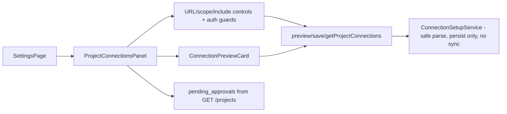

# Prompt E — Project Connections Auth-Aware Setup Flow (Architecture)

**Date:** 2026-06-07  
**Package:** HB_Auth_Onboarding_Implementation_Package (Prompt E)  
**Status:** Implemented (additive frontend surface over existing normalized backend contract)

## Objective

Enable users to add, preview, and save Procore and Microsoft source connections (Procore homepage URL, SharePoint site/folder/share-link, OneDrive with scope modes, Outlook/Calendar include toggles with `project_matching_only` false by default) without starting sync, then surface that the saved connection is queued for explicit admin first-sync approval.

Auth-aware: UI disables Procore-related inputs unless a Procore account is `connected_valid`; disables Microsoft sources unless Graph account is `connected_valid`. Uses account status from the Prompt D surfaces.

## Backend Contract (Repo Truth, Unchanged by E)

Normalized paths (added in Prompt A, delegate to the same `ConnectionSetupService` as legacy `/connections/*` for identical guardrails):

- `POST /api/settings/connections/projects/preview` (viewer ok)
  - Body (ConnectionSetupRequest): `url`, `connection_type`, `project_key`, `source_name`, `scope_mode`, `selected_folder_item_ids`, `include_outlook`, `include_calendar`, ...
  - Response (ProjectConnectionPreviewResponse): `status` ("ready_to_save" | "unavailable"), `detected_source_type`, `proposed_source` (safe ids/urls/names/policies), `warnings`, `first_sync_status` ("pending_admin_approval"), `admin_approval_required: true`, `guardrails`, optional `options` (for calendar/outlook with `project_matching_only: false`).
  - Key invariant: preview performs safe URL parsing/metadata extraction only; `no_live_endpoint_calls`, never starts sync.

- `POST /api/settings/connections/projects/save` (operator)
  - Same body; persists local config (project identity or source location + sync state).
  - Response (ProjectConnectionSaveResponse): `ok`, `connection_id`, `first_sync_status` / `admin_approval_required`, `guardrails`. `first_sync_triggered` remains false.

- `GET /api/settings/connections/projects`
  - Returns `{ pending_approvals: { items: [...], count, ... }, note, guardrails }` with safe per-connection status (pending/approved/rejected).

Legacy root paths (`/connections/preview`, `/connections/save`, `/api/settings/projects`) continue to work (thin delegates to same service).

No tokens, secrets, cache paths, raw external payloads, or live sync side-effects are present in any response.

## Frontend Implementation

### Typed Helpers (`frontend/src/lib/api.ts`)
- `previewProjectConnection(body)`
- `saveProjectConnection(body)`
- `getProjectConnections()`
- Small interfaces (`ProjectConnectionPreviewRequest`, `...Response`, `...SaveResponse`) for callers; any-tolerant retained for page parity with the rest of the app.
- All go through existing `fetchJson` (injects `X-HB-UI-Role`, error handling, relative `/api` paths).

### Components (new, under `frontend/src/components/settings/`, following D patterns)
- `ConnectionPreviewCard.tsx`
  - Props: `preview`, optional `onSave`, `saving`, `saveError`.
  - Renders: status/detected badges, proposed_source (clean key/value), warnings, explicit advisory lines ("Preview complete. No sync has started.", "First sync requires admin approval"), Save button when `ready_to_save`.
  - Never renders raw payloads.

- `ProjectConnectionsPanel.tsx`
  - Consumes `useConnectionsAccounts()` (Prompt D hook) for current `graph`/`procore` status.
  - Controlled form:
    - Primary URL input (Procore `.../project/home`, SharePoint site/folder/share-link, OneDrive personal/tenant).
    - Optional `project_key`, `source_name`.
    - OneDrive `scope_mode` select (`selected_folders` | `all_folders_explicit` | `excluded`) + comma-separated `selected_folder_item_ids` when relevant.
    - Checkboxes "Include Outlook", "Include Calendar" (unchecked = false by default; body flags `include_*`).
  - "Preview" (available even to viewer) → calls preview, renders `<ConnectionPreviewCard preview={...} onSave={doSave} />`.
  - Save (inside card) → calls save (operator role), on success refetches list, surfaces "Connection saved. First sync requires admin approval."
  - Auth-aware disabled states + messages:
    - Procore URL/preview gated behind `procoreStatus === 'connected_valid'` (else link to connect).
    - Microsoft sources (SharePoint/OneDrive/Outlook/Calendar) gated behind `graphStatus === 'connected_valid'`.
  - List section: renders `pending_approvals.items` (or equivalent) showing `connection_id`/`source_id`, `source_type`, `first_sync_status`, `admin_approval_required` badges.
  - Repeated copy: "Preview and save do not start sync."
  - Role/guardrails footer.

### Integration (`frontend/src/pages/SettingsPage.tsx`)
- Import and render `<ProjectConnectionsPanel />` in place of the old "Project Connections (Prompt 14B)" Load button + `projectsResult`/`projectsError` raw-ish block.
- Removed the dedicated state variables and the direct `getSettingsProjects` usage for the accounts section (policy text in Source Scope card remains for documentation).
- Page continues to function for viewer/operator/admin via the header dev role selector.

### Minor Hygiene
- Added the three normalized projects paths to the OpenAPI contract equality in `tests/test_fastapi_analytics_app_shell.py` (Prompt A/E comment) and a light reachability exercise in `tests/test_fastapi_analytics_settings.py` for parity with A/B/C additions.
- No changes to `GetStartedPage.tsx` (it already documents the sequence), navigation model, proxy, theme, or providers.
- No backend modifications (E is a pure frontend guided surface over authoritative contracts from A).

## Auth-Aware Gating & Guardrails

- Gating is purely UI (derived from the safe account status shapes returned by `/api/settings/accounts` and readiness). Backend remains fail-closed on role for mutating calls.
- All data shown is safe metadata (ids, normalized urls without secrets, policy flags, warnings). No raw Procore/Graph payloads, tokens, or cache paths ever reach the DOM.
- Preview and save explicitly advertise (in UI copy and backend responses) that they do not start sync and that first sync is gated behind admin approval (`/api/settings/connections/admin/{id}/approve-first-sync` or legacy equivalent).
- Outlook/Calendar `project_matching_only` is false by default in the backend policy surfaces and reflected in preview `options`.

## Diagrams

Auth-aware preview/save flow (high level):
```mermaid
flowchart TD
  A[Open Project Connections panel] --> C[useConnectionsAccounts for graph/procore status]
  C -->|procore not connected_valid| D1[Disable Procore inputs + "Connect Procore"]
  C -->|graph not connected_valid| D2[Disable MS inputs + "Connect Microsoft 365"]
  C --> F[Form: URL + scope_mode + include_outlook/calendar=false]
  F --> P[Preview → POST /api/settings/connections/projects/preview]
  P --> R{status}
  R -->|ready_to_save| V[ConnectionPreviewCard: proposed, warnings, "no sync", "admin approval required"]
  R -->|unavailable| U[reason_code + message]
  V --> S[(operator) Save → POST /save]
  S --> L[Refetch GET /projects; render list item with first_sync_status + pending]
  L --> Msg["Connection saved. First sync requires admin approval."]
```

Component reuse:


## References

- Prompt E objective/scope/AC/validation/risk notes.
- Backend contracts: `04_BACKEND_ROUTE_CONTRACTS.md`, `auth_route_contracts.json`, actual Pydantic models (`ConnectionSetupRequest`, `ProjectConnectionPreviewResponse`, `ProjectConnectionSaveResponse`) and `ConnectionSetupService` in `src/hb_assistant/construction/analytics/{api.py,connection_setup.py}`.
- Prior architecture: 172 (Prompt A normalized routes + safe models), 175 (Prompt D panel/card + accounts hook + auth gating patterns).
- Existing tests: `tests/test_fastapi_analytics_connection_setup.py` (core invariants: preview/save never start sync, role gates, outlook defaults, onedrive scope modes, procore homepage forms), `tests/test_fastapi_analytics_settings.py` (reachability), `tests/test_fastapi_analytics_app_shell.py` (OpenAPI surface).
- Frontend patterns from Prompt D: `AccountConnectionsPanel`/`GraphConnectionCard`/`ProcoreConnectionCard`, `useConnectionsAccounts`, `fetchJson` role injection, card/badge/advisory, ErrorState.
- Guardrails: FORBIDDEN posture, local-first, read-only, advisory-only, explicit separation of "save config" from "admin approval" from "live sync".

## Validation

Executed exactly (see run record in session):
- `python -m pytest tests/test_fastapi_analytics_connection_setup.py tests/test_fastapi_analytics_settings.py`
- `python -m ruff check src/hb_assistant/construction/analytics tests/test_fastapi_analytics_connection_setup.py`
- `cd frontend && npm run lint && npm run typecheck && npm run build`

All green after any surfaced fixes (light test hygiene + import/state cleanup).

## Acceptance

- User can enter Procore project homepage URL (and other supported forms).
- Preview shows parsed safe metadata + "no sync started" + "admin approval required".
- Save succeeds for operator; list updates with pending status.
- Outlook/Calendar toggles default to false; options reflect `project_matching_only: false`.
- Auth-disabled states appear when the corresponding account is not valid.
- No source sync is triggered by any UI action in this flow.
- No raw payloads or secrets exposed.

This completes the guided "after accounts → project connections (Prompt E) → admin approval (Prompt F)" step in the onboarding sequence while preserving all prior guardrails.
