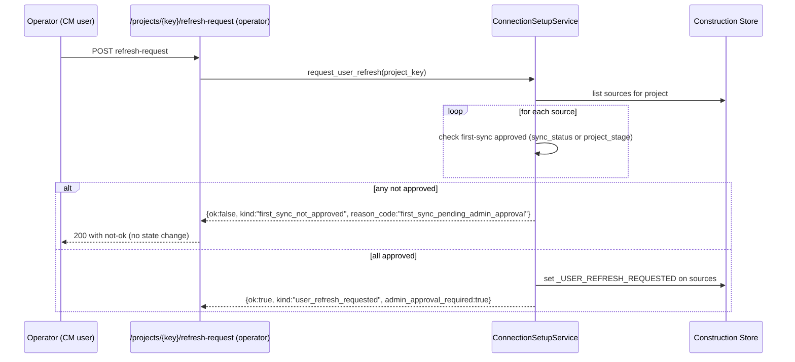
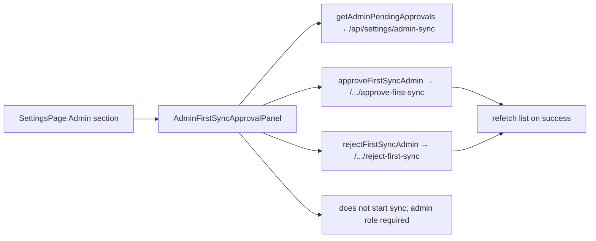

# Prompt F — Admin First-Sync Approval Integration (HB Auth Onboarding Implementation Package 1.3.0)

**Date**: 2026-06-07  
**Status**: Implemented  
**Scope**: Normalize first-sync approval across source connections (Microsoft file/email/calendar + Procore projects). Enforce sync eligibility at domain service level so no live/manual/scheduled sync can proceed before admin approval. Add reject as first-class action. Replace raw admin stub in Settings with interactive panel. All responses safe; no tokens/secrets/paths/raw payloads; no action starts sync.

## Objectives (from Prompt F spec)
- Every saved source connection has an approval status (pending/approved/rejected).
- Normalized admin endpoints under `/api/settings/connections/admin/*` (approve already present; add reject).
- Sync eligibility checks used by manual refresh (and contract for scheduled paths).
- Procore project identities participate fully in list/approve/reject (same model as file sources).
- Admin Settings panel for interactive pending approvals (replaces Load + raw stub).
- Non-admin cannot approve/reject (backend role gate).
- `first_sync_triggered` always false on approve/reject/save/preview.
- Guardrails surface `first_sync_triggered: false`, `admin_approval_required: true`.

## Repo Truth Before Prompt F (Gaps Closed)
- Save paths (Prompt E + prior) already wrote pending markers:
  - File sources: `source_sync_state.sync_status = "pending_admin_approval"` (or `_PENDING`).
  - Procore: `construction_project_identity.project_stage = "setup_pending_admin_approval"`.
- Approve existed (legacy + normalized `/api/settings/connections/admin/{id}/approve-first-sync`) but:
  - For Procore: found identity but returned early without flipping `project_stage` to approved.
  - `list_pending_approvals` only scanned `source_locations`; Procore identities were invisible to admin list.
- No `reject_first_sync`.
- No eligibility gate in `request_user_refresh` (operator manual path) — could set `_USER_REFRESH_REQUESTED` even if pending.
- Settings "Admin Sync Controls" used raw `getSettingsAdminSync()` + JSON display + sample patch (stub).
- No unified domain helper for "is first-sync approved".

All changes are additive/surgical within analytics service + api; no scheduled runner changes beyond the domain columns + service checks (scheduler can consult the same markers).

## Service Changes (ConnectionSetupService)
- `approve_first_sync(connection_id)`:
  - File source path unchanged (upsert `_APPROVED` into sync_state).
  - Procore path: now fetches identity, re-calls `upsert_project_identity(..., project_stage=_APPROVED)` preserving other fields (hb number, name, procore id, match, timestamps), then returns the safe approval response.
  - Always `first_sync_triggered: false`.
- `list_pending_approvals()`:
  - Existing source + sync_state scan for pending markers preserved.
  - Added best-effort scan of `construction_project_identity` for stages containing "pending" or exactly "setup_pending_admin_approval".
  - Emits Procore items with stable `connection_like_id = "procore_{project_key}"` (so approve/reject replace logic works unchanged).
  - Includes project_key, source_name, sync_status/project_stage, last timestamps. Safe only.
- New: `reject_first_sync(connection_id)` (symmetric):
  - File: upsert sync_state to `"first_sync_rejected"`.
  - Procore: upsert identity with `project_stage = "first_sync_rejected"`.
  - Returns safe shape: `ok, kind:"first_sync_rejected", first_sync_status, first_sync_triggered:false, guardrails`.
- New private: `_is_first_sync_approved(*, source_id=None, project_key=None) -> (bool, reason|None)`:
  - Checks `sync_status == _APPROVED or "approved" in status` for sources.
  - Checks `project_stage == _APPROVED or "approved" in stage` for procore identities.
  - Used by refresh gate and reusable for future surfaces.
- `request_user_refresh(project_key)`:
  - After "no sources" early return, before any state mutation: loop sources and call eligibility for each (source_id and fallback project_key for procore).
  - If any not approved: return `{ok:false, kind:"first_sync_not_approved", reason_code:"first_sync_pending_admin_approval", admin_approval_required:true, guardrails}` — **no state change**.
  - Only when all pass, proceed to set `_USER_REFRESH_REQUESTED` (existing behavior).
- `_guardrails()` already emits `first_sync_triggered: false`; unchanged.
- Constants: `_PENDING`, `_APPROVED`, `_USER_REFRESH_REQUESTED`, `_rejection_response` helper added.

These columns (`sync_status` / `project_stage`) + the service methods are the source of truth for eligibility; cross-platform scheduler can/should call the same service or read the markers.

## Routes (api.py)
- Approve normalized (from A): `POST /api/settings/connections/admin/{connection_id}/approve-first-sync` (require_admin_role) → `AdminApprovalResponse`.
- Legacy `/admin/connections/{id}/approve-first-sync` preserved for compatibility.
- New (additive): `POST /api/settings/connections/admin/{connection_id}/reject-first-sync` (require_admin_role) → `AdminApprovalResponse` (reuse shape; `kind` distinguishes).
- `GET /api/settings/admin-sync` (and legacy) now richer (includes procore items from enhanced list).
- Admin role enforced via `require_admin_role(role_dep)` + `X-HB-UI-Role` header (local dev); non-admin → 403.
- No new eligibility read endpoint needed (pending list + item status suffices); future can expose per-connection if desired.
- All responses go through safe projections; never include tokens, cache paths, raw deltas, etc.

## Frontend Additions
- `frontend/src/lib/api.ts`:
  - `AdminApprovalResponse` interface (ok/kind/connection_id/source_type/first_sync_status/first_sync_triggered/guardrails/message).
  - `getAdminPendingApprovals()` → GET `/api/settings/admin-sync`.
  - `approveFirstSyncAdmin(id)` → POST normalized approve.
  - `rejectFirstSyncAdmin(id)` → POST normalized reject.
  - Re-exported in aggregate `api`.
  - Header comment updated for Prompt F.
- New component: `frontend/src/components/settings/AdminFirstSyncApprovalPanel.tsx`:
  - On mount/refresh: calls `getAdminPendingApprovals()` (admin surface).
  - Renders clean list of safe items (connection_like_id, project_key, source_name, status, last_attempted).
  - Actions: "Approve first sync" / "Reject" (disabled while busy).
  - On success: brief message + refetch list.
  - Explicit copy: "approvals are required before any live sync; this action does not start sync (`first_sync_triggered` will be false)".
  - Loading, ErrorState, guardrails footer note ("only admin role can act").
  - Never renders raw payloads or auth material (backend is already safe).
- `frontend/src/pages/SettingsPage.tsx`:
  - Import `AdminFirstSyncApprovalPanel`.
  - In "Admin Sync Controls" card: replaced the Load button + raw `adminSyncResult` display + error retry block with `<AdminFirstSyncApprovalPanel />`.
  - Retained the "Apply sample admin rate limit" patch button (small separate admin action).
  - Removed now-unused `adminSyncResult`/`adminSyncError` state (kept `adminPatchMsg`).
  - Updated descriptive text: "Pending first-sync approvals. Only admins can approve or reject. Approvals do not start sync."
  - Import of `getSettingsAdminSync` removed (no longer used directly here).
- Role: backend enforces; UI is in the admin section of Settings. Non-admins get 403 on action calls (or can simply not see/use the section).

No raw JSON/debug for normal users; clear "does not start sync" language.

## Eligibility & Sync Contract
- Manual operator path (`/projects/{key}/refresh-request`) now gated.
- Scheduled paths (future cross-platform) are expected to consult the same DB columns or call the service eligibility before queuing/executing live work.
- `first_sync_triggered` remains a hard false on all save/preview/approve/reject surfaces.
- `admin_approval_required: true` surfaces in readiness, save, approval responses.

## Mermaid Diagrams

### Approve / Reject + Procore parity
```mermaid
flowchart TD
  Save[Save connection (any type)] --> Mark[Write pending marker\n(file: sync_status=pending_admin_approval\nProcore: project_stage=setup_pending_admin_approval)]
  Mark --> List[Admin calls list_pending_approvals\n(now includes both source_locations and project_identity pending)]
  List --> Admin[AdminFirstSyncApprovalPanel]
  Admin --> Approve[POST .../approve-first-sync (admin)]
  Admin --> Reject[POST .../reject-first-sync (admin)]
  Approve --> File[If file source: upsert sync_state=_APPROVED]
  Approve --> Pro[If procore: upsert project_identity project_stage=_APPROVED]
  Reject --> FileR[If file: upsert rejected marker]
  Reject --> ProR[If procore: upsert rejected stage]
  Approve --> Resp[Safe response: first_sync_triggered=false]
  Reject --> Resp
```

### Eligibility gate on manual refresh


### Panel composition and action (high level)


## References
- Prompt F spec (objective/scope/AC/validation/risk) + attached plan.
- `04_BACKEND_ROUTE_CONTRACTS.md` + `auth_route_contracts.json` (normalized contracts under /api/settings/connections/* and /onboarding).
- Prior architecture:
  - `172-prompt-a-auth-route-contract-safe-status-models.md` (AdminApprovalResponse, admin routes family).
  - `175-prompt-d-get-started-and-account-connections-ux.md`.
  - `176-prompt-e-project-connections-auth-aware-setup-flow.md` (save writes pending; Procore save path; panel patterns).
- Service: `src/hb_assistant/construction/analytics/connection_setup.py` (ConnectionSetupService, _save_procore, request_user_refresh, list/approve).
- Routes: `src/hb_assistant/construction/analytics/api.py` (require_admin_role, normalized admin surfaces).
- Frontend: `frontend/src/lib/api.ts`, `AdminFirstSyncApprovalPanel.tsx`, `SettingsPage.tsx`.
- Tests: `tests/test_fastapi_analytics_connection_setup.py` (new test_prompt_f_..., extended procore save/approve), `tests/test_fastapi_analytics_sync_governance.py` (procore item in list), `tests/test_fastapi_analytics_auth_onboarding.py` (-k 'approval or sync' slice).
- Guardrails and _assert_safe usage throughout.
- Risk note: Scheduled sync may be cross-platform; eligibility must be backend/domain-level (done via columns + service), not only UI disabled states.

## Validation (exact per prompt)
```bash
python -m pytest tests/test_fastapi_analytics_connection_setup.py tests/test_fastapi_analytics_auth_onboarding.py -k 'approval or sync'
python -m ruff check src/hb_assistant/construction/analytics tests/test_fastapi_analytics_connection_setup.py tests/test_fastapi_analytics_auth_onboarding.py
cd frontend && npm run lint && npm run typecheck && npm run build
```
All green at closeout.

## Non-Scope / Future
- No implementation of actual scheduled/delta runners or cross-platform launcher beyond the eligibility contract.
- No source writeback.
- Approval controls remain admin-only (role gate).
- If a per-connection eligibility read or richer pending list UI is needed later, it can be added without changing the core model.

This completes the admin-controlled first-sync approval model for the local-first onboarding flow.
