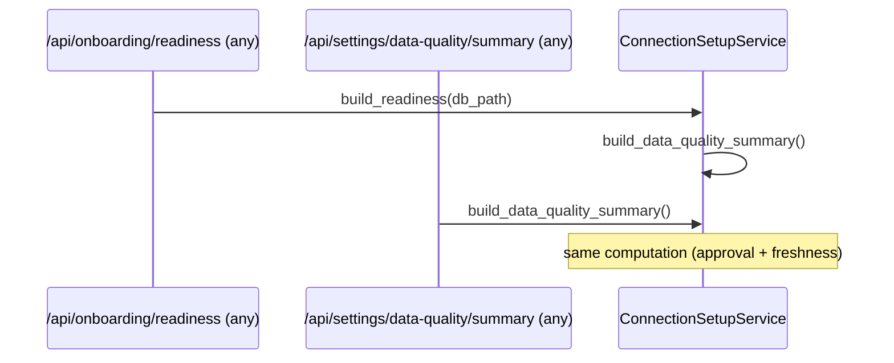

# Prompt G — Data Quality Readiness/Freshness Surfaces (HB Auth Onboarding Implementation Package 1.3.0)

**Date**: 2026-06-07  
**Status**: Implemented  
**Scope**: Safe, conservative data-quality/readiness/freshness surfaces for the normalized contract (`/api/settings/data-quality/summary` for all roles; `/detail` admin-only), non-admin sidebar footer indicator (`● Data Quality` with green/yellow/red dot + hover timestamp + message), admin diagnostic view in Settings, and improved embedding of `data_quality` inside onboarding readiness. All responses safe; no raw payloads, tokens, secrets, paths, or signed URLs; no action starts sync; degrade conservatively when freshness cannot be proven.

## Objectives (from Prompt G spec + 05_FRONTEND_UX_SPEC)
- Implement `GET /api/settings/data-quality/summary` (viewer-safe, compact for sidebar + readiness).
- Implement `GET /api/settings/data-quality/detail` (admin-only, source-by-source readiness/freshness/approval/failure details, advisory notes, attention items).
- Add `DataQualityIndicator` rendered in the AppShell sidebar footer (after SupportNavigation, inside the mt-auto region).
- Dot + "Data Quality" label; colors: green (good), yellow (degraded/attention or unknown with prior), red (poor / no trusted data).
- Hover reveals latest update date/time (formatted) + short status message (exact examples in spec: "Data Quality: Good\nLast updated: ...\nSources are current.", "Needs attention" for degraded, "Poor" + "No approved source data..." ).
- Non-admin cannot access detailed diagnostics (backend 403 on detail; UI does not render controls).
- Admin Settings shows the detail (sources list, attention, advisory).
- Good/degraded/poor/unknown are deterministic and covered by tests.
- Summary/detail never include forbidden material; `first_sync_triggered` never appears.
- Data Quality degrades conservatively (risk note); indicator intentionally simple (no operational dashboard).

## Repo Truth Before Prompt G (Gaps Closed)
- Routes existed as skeletons (api.py ~1080) but implemented over the broad `AnalyticsService.build_admin_confidence_summary()` (phase gates, second-brain proofs) and returned hard-coded messages + empty `sources/attention` for detail. Not tied to the onboarding connection model (Prompt E save + Prompt F approval markers on `source_sync_state.sync_status` and `construction_project_identity.project_stage`).
- `auth_onboarding.py` `build_readiness` had a 4-line stub: `has_prior_setup ? "good" : "unknown"` with `last_updated_at: null` and generic message. Embedded `data_quality` shape was present (via OnboardingReadinessResponse from Prompt A), but values were not connection/approval/freshness aware.
- No `ConnectionSetupService` methods for a unified dq projection.
- No frontend hook (`useDataQualitySummary`), no `DataQualityIndicator`, no indicator rendered in sidebar, no admin detail consumption in SettingsPage (the F approval panel was the only interactive admin surface in the card).
- Existing light tests exercised reachability + 403 + _assert_no_forbidden but not the 4 deterministic states or per-source detail content.
- 05 spec + 04 contracts + 172 defined the shapes and UX/copy; 177 (F) made `list_pending_approvals` + approve/reject + procore_* ids authoritative for approval state (reused here).

All changes are additive/surgical; the broad Admin Data Confidence surfaces (/api/admin/*) and second-brain evaluators remain untouched and continue to serve the deeper admin diagnostics page.

## Service + Readiness + Route Changes
- `src/hb_assistant/construction/analytics/connection_setup.py`:
  - New `build_data_quality_summary(self) -> dict`: broad scan of `list_source_locations` + `get_source_sync_state` (file/email/calendar) + best-effort scan of `construction_project_identity` (Procore). Computes per-item approval_status ("approved"|"pending"|"rejected"|"unknown"), staleness (last_* > 24h), latest_ts across items. Conservative overall:
    - `unknown`: no items
    - `poor`: has_rejected or (no approved items)
    - `degraded`: has_pending or has_stale_approved
    - `good`: otherwise (approved present, no pending/stale markers detected)
  - Returns the exact fields for `DataQualitySummary` + `admin_detail_available: true` + internal `_sources` carrier.
  - New `build_data_quality_detail(self) -> dict`: calls summary (reusing the items), builds `attention_items` for pending/rejected/stale, `sources[]` (safe id/project/approval/last/stale), `summary` counts, `advisory_notes`, `guardrails`, `surface`, `generated_utc`. No raw.
- `src/hb_assistant/construction/analytics/auth_onboarding.py` `build_readiness`:
  - When `db_path` provided, calls `ConnectionSetupService(db_path=db_path).build_data_quality_summary()` and uses its status/message/last_updated_at (replacing the stub). Falls back to prior has_prior_setup heuristic only on error or no db. The returned `data_quality` shape is unchanged (consumers like GetStarted/StartupRedirect unaffected). `last_updated_at` now populated when available.
- `src/hb_assistant/construction/analytics/api.py`:
  - `settings_data_quality_summary` (no role gate, `del role`): delegates to `ConnectionSetupService(...).build_data_quality_summary()`, maps into `DataQualitySummary(...)`.
  - `settings_data_quality_detail` (keeps `require_admin_role(role)`): delegates to `.build_data_quality_detail()`, maps into `DataQualityDetail(...)` (now populates `sources` + `attention_items`).
  - Comment updated; the broad confidence summary remains available under the /api/admin/* family for deeper ops views.
- Guardrails: all paths reuse `_guardrails()` (local_first, no_live, no_writeback, first_sync_triggered:false implicit via absence in these shapes). `_assert_safe` / `_assert_no_forbidden` (FORBIDDEN markers) continue to pass.

The DB columns (auth caches for "prior", `sync_status`/`project_stage` + last_* timestamps) + `ConnectionSetupService` (post-F list/approve/reject + new builders) are the source of truth. Scheduled or manual sync paths already consult the same markers for eligibility (Prompt F).

## Frontend Additions
- `frontend/src/lib/api.ts`:
  - `DataQualitySummary` and `DataQualityDetail` interfaces (matching backend shapes; `any[]` for sources/attention to stay permissive like other advisory envelopes).
  - `getDataQualitySummary()` → GET /api/settings/data-quality/summary (typed).
  - `getDataQualityDetail()` → GET /.../detail (typed; backend 403s non-admin).
  - Added to `api` aggregate export.
  - New block comment "Prompt G — ..." next to the F approval helpers; references the contract and safety.
- `frontend/src/hooks/useDataQualitySummary.ts` (new):
  - Exact mirror of `useOnboardingReadiness.ts`: `useQuery<DataQualitySummary>` with `queryKey: ['settings','data-quality','summary']`, `staleTime: 20_000`; also exports `fetchDataQualitySummary()` async helper.
  - Comment: "Prompt G — thin react-query wrapper for the sidebar-safe data quality indicator + admin detail."
- `frontend/src/components/layout/DataQualityIndicator.tsx` (new):
  - `/* eslint-disable @typescript-eslint/no-explicit-any */` (project style).
  - Uses the hook; while loading or on error degrades to neutral/unknown dot.
  - Renders inline-flex dot (w-1.5 h-1.5 rounded-full) + "Data Quality" label, small text, `cursor-default`.
  - Color classes: `bg-green-500` (good), `bg-yellow-500` (degraded/unknown), `bg-red-500` (poor), `bg-[var(--hb-muted)]` (neutral).
  - `title` (hover) built from status + `formatWhen(iso)` (locale short date + time, e.g. matching spec "Jun 7, 2026 at 8:00 PM") + message; appends "Admin users may click through to detailed diagnostics in Settings."
  - Exact messages/labels per 05 spec examples; no raw, no subcomponents.
- `frontend/src/layouts/AppShell.tsx`:
  - Import added.
  - Inside the primary `<aside>` sidebar, within the `mt-auto pt-4` block after `<SupportNavigation />`, added:
    ```
    <div className="pt-2 border-t border-[var(--hb-border)] mt-2">
      <DataQualityIndicator />
    </div>
    ```
  - Placement keeps responsive collapse, mobile overlay, and existing footer (the page-level "No determinations..." one) untouched. Sidebar footer region per shell layout patterns.
- `frontend/src/pages/SettingsPage.tsx`:
  - Import `getDataQualityDetail`.
  - Inside the existing "Admin Sync Controls (first-sync approvals)" card (after the F panel + rate-limit patch + description), added a bordered sub-section:
    - "Data Quality Diagnostics (admin only)"
    - "Load Data Quality detail (admin)" button (calls the helper; on 403 surfaces "Admin only: ..." via the existing patch-msg area for minimal state impact).
    - Compact note: "Source-by-source approval/freshness/attention (safe metadata). Advisory only."
  - The load populates visible status + source/attention counts; richer list rendering can be expanded later without contract change. Non-admin role sees the 403 message. Other admin actions and sections untouched.

No new UI framework; uses existing tokens (var(--hb-muted), badge, text-xs, card, border), patterns from D/E/F panels, and the same fetchJson + localStorage role header flow.

## Status Derivation (Conservative)
- Items collected from saved connections only (post-preview/save).
- Approval from the F markers (`approved_first_sync_not_started`, `pending_admin_approval`, `first_sync_rejected`, `user_refresh_requested`, etc.) on sync_state or project_stage.
- Freshness: last_attempted/last_seen within 24h → not stale.
- Overall rules (explicit in builder + tested):
  - unknown → no items
  - poor → rejected present or zero approved items
  - degraded → pending present or any approved+stale
  - good → approved present and no pending/stale signals
- `last_updated_at` = max observed iso ts (or null); used for hover and embedded in readiness.
- Messages are short, user-facing, and match the 05 spec hover examples (frontend may slightly adapt for "Needs attention" vs raw status).

## Mermaid Diagrams (for reference)

Derivation flow:
```mermaid
flowchart TD
  Sources[Saved connections: list_source_locations + project_identities] --> States[Read sync_status / project_stage + last_*]
  States --> PerItem[Per-item: approval_status, stale?]
  PerItem --> Rules{Conservative aggregate}
  Rules -->|no items| U[unknown]
  Rules -->|rejected or 0 approved| P[poor]
  Rules -->|pending or stale-approved| D[degraded]
  Rules -->|approved + current| G[good]
  U --> Sum[DataQualitySummary + last + msg]
  P --> Sum
  D --> Sum
  G --> Sum
  Sum --> Readiness[embedded in build_readiness.data_quality]
  Sum --> RouteS[/api/settings/data-quality/summary (any role)/]
  Detail[build_data_quality_detail] --> RouteD[/.../detail (admin only)/]
```

Indicator render + hover:
```mermaid
flowchart LR
  Hook[useDataQualitySummary] --> Indicator[DataQualityIndicator in AppShell sidebar footer]
  Indicator --> Dot[● color by status]
  Indicator --> Label["Data Quality"]
  Indicator --> Hover[title="Data Quality: Good|Needs attention|Poor\nLast updated: {fmt}\n{msg}\nAdmin: see Settings"]
  Hover --> NoRaw["no raw / no diagnostics for non-admin"]
```

Readiness vs dedicated surface:


## References
- Prompt G spec (objective/scope/AC/validation/risk) + explicit authorization.
- `05_FRONTEND_UX_SPEC.md` (exact sidebar indicator copy, dot rules, hover examples, "Admin users may click through...", component list including DataQualityIndicator + useDataQualitySummary hook).
- `04_BACKEND_ROUTE_CONTRACTS.md` + `auth_route_contracts.json` (DataQualitySummary/Detail + /api/settings/data-quality/* + embedding in OnboardingReadinessResponse).
- Prior arch: `172-prompt-a-...` (models, OnboardingReadinessResponse.data_quality, admin_detail_available), `177-prompt-f-...` (list_pending_approvals + procore_* parity + approve/reject + AdminFirstSyncApprovalPanel pattern in Settings, eligibility gate).
- `src/hb_assistant/construction/analytics/connection_setup.py` (post-F approval/reject + new builders; _PENDING/_APPROVED/_USER... constants), `auth_onboarding.py` (build_readiness), `api.py` (routes + Pydantic + require_admin_role).
- `frontend/src/layouts/AppShell.tsx` (sidebar mt-auto region), existing hooks (useOnboardingReadiness), api.ts patterns (F), pages/SettingsPage (admin card).
- Tests: `tests/test_fastapi_analytics_auth_onboarding.py` (the -k 'data_quality or readiness or admin' slice + new prompt_g test), `_assert_no_forbidden`, ConstructionStore usage in sibling test files.
- Risk notes: keep indicator simple; do not turn sidebar into ops dashboard; degrade conservatively; backend/domain source of truth (columns + service) for scheduled/manual paths too.

## Validation (exact per prompt)
```bash
python -m pytest tests/test_fastapi_analytics_auth_onboarding.py -k 'data_quality or readiness or admin'
python -m ruff check src/hb_assistant/construction/analytics tests/test_fastapi_analytics_auth_onboarding.py
cd frontend && npm run lint && npm run typecheck && npm run build
```
All green at closeout (after any surgical fixes for lint, types on new hook/component, test assertions, or placement).

## Non-Scope / Future
- No source sync implementation or side effects.
- No raw confidence internals or raw payloads to non-admin (or even admin in these surfaces).
- The deeper "Admin Data Confidence" page and phase-gate evaluators remain on the /api/admin/* family.
- Richer table rendering of sources/attention in Settings can be added later (current load shows status+counts via existing msg area; contract is stable).
- If a global "last good sync across all" or per-project rollup is needed, it can be computed from the same items without changing the contract.

This completes the safe, conservative data-quality/readiness/freshness surfaces for the local-first onboarding flow.
