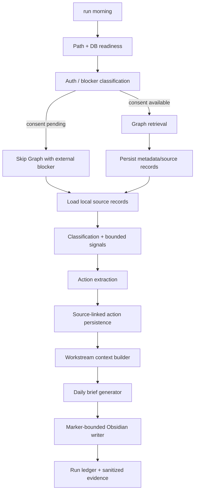
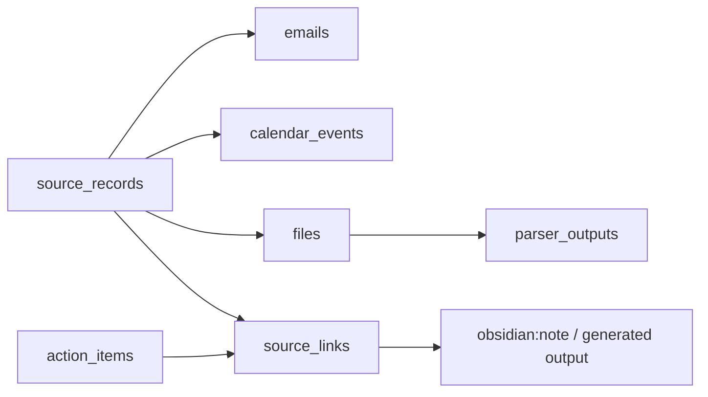
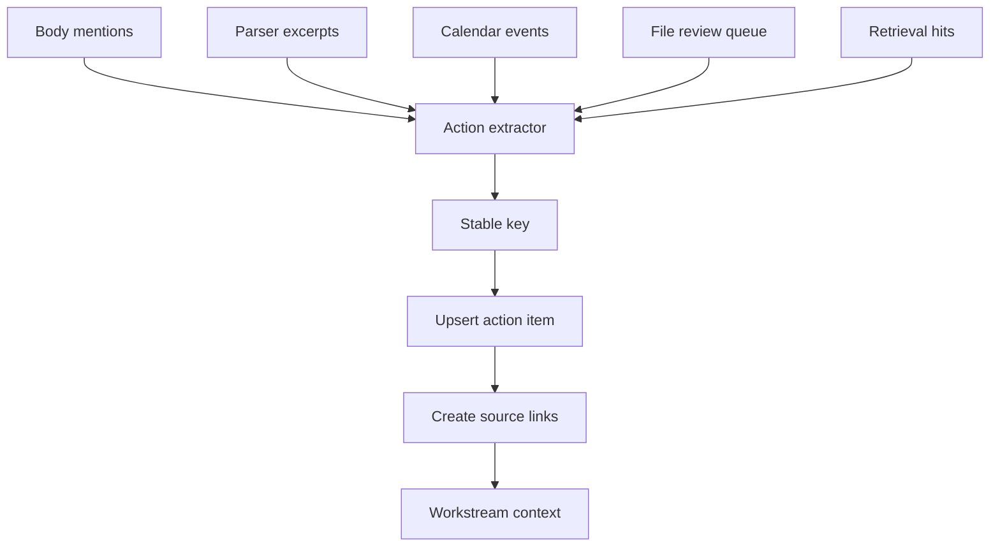
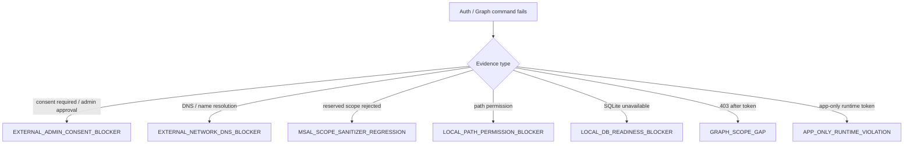

# 14 — Architecture Diagrams

## Phase 14 Local Runtime Flow

```mermaid
flowchart TD
  A[run morning] --> B[Path + DB readiness]
  B --> C[Auth / blocker classification]
  C -->|consent available| D[Graph retrieval]
  C -->|consent pending| E[Skip Graph with external blocker]
  D --> F[Persist metadata/source records]
  E --> G[Load local source records]
  F --> G
  G --> H[Classification + bounded signals]
  H --> I[Action extraction]
  I --> J[Source-linked action persistence]
  J --> K[Workstream context builder]
  K --> L[Daily brief generator]
  L --> M[Marker-bounded Obsidian writer]
  M --> N[Run ledger + sanitized evidence]
```

## Source Link Model

```mermaid
flowchart LR
  SR[source_records] --> E[emails]
  SR --> C[calendar_events]
  SR --> F[files]
  F --> P[parser_outputs]
  SR --> SL[source_links]
  AI[action_items] --> SL
  SL --> OUT[obsidian:note / generated output]
```

## Action Extraction Model

```mermaid
flowchart TD
  A[Body mentions] --> X[Action extractor]
  B[Parser excerpts] --> X
  C[Calendar events] --> X
  D[File review queue] --> X
  E[Retrieval hits] --> X
  X --> K[Stable key]
  K --> U[Upsert action item]
  U --> L[Create source links]
  L --> W[Workstream context]
```

## Blocker Classification

```mermaid
flowchart TD
  A[Auth / Graph command fails] --> B{Evidence type}
  B -->|consent required / admin approval| C[EXTERNAL_ADMIN_CONSENT_BLOCKER]
  B -->|DNS / name resolution| D[EXTERNAL_NETWORK_DNS_BLOCKER]
  B -->|reserved scope rejected| E[MSAL_SCOPE_SANITIZER_REGRESSION]
  B -->|path permission| F[LOCAL_PATH_PERMISSION_BLOCKER]
  B -->|SQLite unavailable| G[LOCAL_DB_READINESS_BLOCKER]
  B -->|403 after token| H[GRAPH_SCOPE_GAP]
  B -->|app-only runtime token| I[APP_ONLY_RUNTIME_VIOLATION]
```
